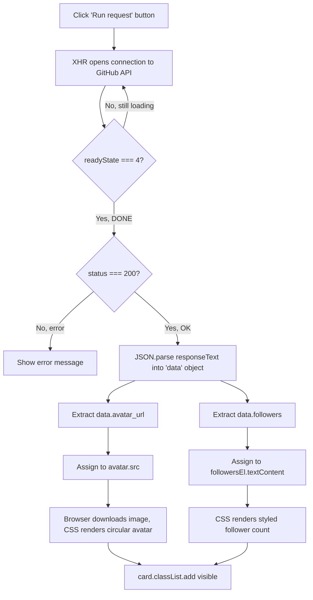

## How Data Flows Through the App

The core idea is a four-stage pipeline: **fetch → extract → store → inject**.
The API gives you one big JSON object; you pull only the two fields you care
about, save them into variables, then hand those variables to the DOM so CSS
can style what's already sitting on the page.

### 1. Fetch — request the data

An `XMLHttpRequest` is sent to the GitHub API. The API doesn't return an
image file or a number directly — it returns a **JSON object** containing
dozens of fields about the user (bio, repos, company, avatar URL, follower
count, etc.).

### 2. Extract — pull out only what you need

Once `xhr.readyState === 4` (DONE) and `xhr.status === 200` (OK), the raw
response text is parsed into a JS object:

```js
const data = JSON.parse(xhr.responseText);
```

From that object, two fields are pulled out:

```js
data.avatar_url   // a URL string pointing to the profile picture
data.followers    // a number
```

Note: `avatar_url` isn't the image itself — it's a **link** to the image.
The actual picture is downloaded separately, by the browser, once you set
it as an `` source.

### 3. Store — inject into variables

Those two values are assigned to existing DOM element references, which
act as your "variables" holding the extracted data:

```js
avatar.src        = data.avatar_url;   // image element's source
followersEl.textContent = data.followers;   // text node's content
```

### 4. Inject — hand it to the design

Because `avatar` and `followersEl` are real elements already styled with
CSS (circular border-radius, colors, spacing), the moment their `.src` or
`.textContent` changes, the browser repaints them using the existing
styles. No extra design code runs at this point — the CSS was already
waiting for content.

### Flowchart



### Why this pattern matters

Separating **extraction** (getting values out of JSON) from **injection**
(putting values into the DOM) keeps the code easy to debug — if the card
shows the wrong data, you check the extraction step; if it shows no data
at all, you check the injection step.